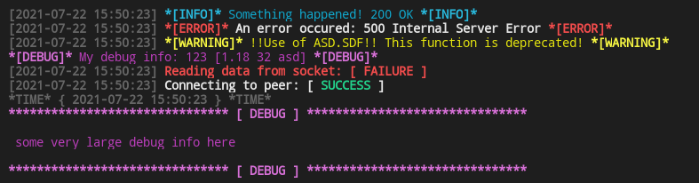

# go-logger
Simply colorful console logger for Go

## Intriduction

This package implements a simple logging API for Golang. The main idea of this project is to minimise the amount of code 
you need to write to log something. You receive pretty colorful log messages wherever you want without any terrible settings and function calls

## Look and feel

```go
package main

import (
	"encoding/json"

	logging "github.com/Roma004/go-logger"
)

type Abc struct {
	Abc string `json:"field_one"`
	Asd string `json:"field_two"`
}

func main() {

	log := logging.MyLog{}

	log.Info("Start of func main")

	a := Abc{
		Abc: "hello from Golang",
		Asd: "I hate coding in Go ;(",
	}

	b, err := json.Marshal(a)
	if err != nil {
		log.Error("JSON Marshal error", err)
	}
	log.LargeDebug(b, "\n\n", string(b))
	log.Info("struct Abc marshaled, result:", string(b))

	b = append(b, 18)
	log.Warning("Try to fail json.Unmarshal")

	var data Abc
	err = json.Unmarshal(b, &data)
	if err != nil {
		log.Error("Unmarshalling data failure", err)
		log.FailureStatus("Unmarshalling data", "FAILURE")
	}

	log.Debug(data)

	log.Info("End of func main")
}
```


All functions in one piece of code

```go
package main

import logging "github.com/Roma004/go-logger"

func main() {
	log := logging.MyLog{}

	log.Info("Something happened!", 200, "OK")
	log.ErrorLog("An error occured:", 500, "Internal Server Error")
	log.Warning("!!Use of ASD.SDF!! This function is deprecated!")
	log.Debug("My debug info:", 123, []interface{}{1.18, 32, "asd"})
	log.FailureStatus("Reading data from socket", "FAILURE")
	log.SuccessStatus("Connecting to peer", "SUCCESS")
	log.Time()
	log.LargeDebug("some very large debug info here")
}
```


## Installation

Install package using `go get`:

```sh
go get github.com/Roma004/go-logger
```

just import it in your code:
```go
import (
    ...

    logging "github.com/Roma004/go-logger"
)
```

And enjoy!

# Documentation

for dosc see `https://pkg.go.dev/github.com/Roma004/go-logger`
